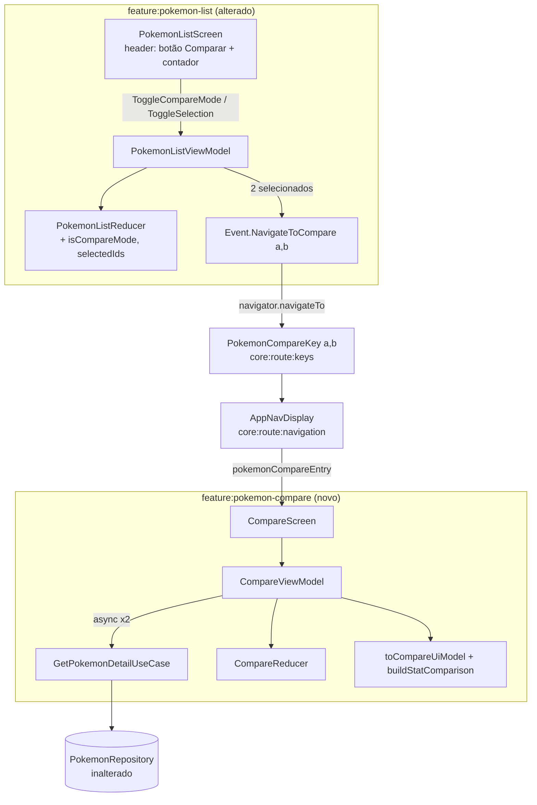

# Pokemon Compare Design

**Spec**: `.specs/features/pokemon-compare/spec.md`
**Context**: `.specs/features/pokemon-compare/context.md`
**Status**: Draft

---

## Architecture Overview

Nova `feature:pokemon-compare` (módulo MVI, espelhando `feature:pokemon-detail`) + alterações de **modo seleção** em `feature:pokemon-list` + nova rota em `core:route:keys`. **Zero mudança em `core:domain`/`data:*`** (a única alteração fora das features é DI — ver Tech Decisions). O carregamento usa o `GetPokemonDetailUseCase` existente, chamado 2× (em paralelo).

> 📊 Diagrama renderizado: [`diagrams/compare-architecture-flow.svg`](diagrams/compare-architecture-flow.svg) · [`.png`](diagrams/compare-architecture-flow.png) · fonte [`.mmd`](diagrams/compare-architecture-flow.mmd) (gerado via mermaid-studio). Legenda de cores: âmbar = `pokemon-list` (alterado) · índigo = `pokemon-compare` (novo) · cinza = navegação (`core:route:*`) · verde = repositório (inalterado).



**Fluxo P1:** lista (modo seleção) → marca 2 → `NavigateToCompare(a,b)` → `PokemonCompareKey` → `CompareScreen` → `CompareViewModel` carrega os 2 em paralelo → estado `success` com os 2 `CompareUiModel` + comparação de stats → UI lado a lado com realce.

---

## Code Reuse Analysis

### Existing Components to Leverage

| Component | Location | How to Use |
|---|---|---|
| `GetPokemonDetailUseCase(id): Result<Pokemon>` | `core/domain/.../usecase/` | Chamar 2× (1 por Pokémon). **Sem alteração.** |
| `PokemonStatBar(label, value, color, modifier)` | `core/ui/.../PokemonStatBar.kt` | Renderizar cada Base Stat. Recebe **primitivos** → realce do vencedor via parâmetro `color`. **Sem alteração.** |
| `PokemonTypeChip(typeName)` | `core/design-system/.../component/` | Chips de tipo de cada Pokémon. |
| `pokemonTypeColor(name): Color` | `core/design-system/.../theme/Color.kt` | Cor primária por tipo (header/realce). |
| `PokemonImageUrlProvider.officialArtwork(id)` | `core/design-system/.../util/` | URL do artwork. |
| `LoadingIndicator()` / `ErrorContent(message, onRetry)` | `core/design-system/.../component/` | Estados loading/error (mesmo padrão do detalhe). |
| MVI do `pokemon-detail` (State/Reducer/VM/mapper) | `feature/pokemon-detail/...` | **Espelhar a estrutura** (não importar — features não se conhecem). |
| `koinViewModel(parameters = parametersOf(...))` | padrão do detalhe | VM parametrizado por ids. |

### Integration Points

| System | Integration Method |
|---|---|
| Navegação (`core:route:keys` + `AppNavDisplay`) | Nova `PokemonCompareKey`; novo `pokemonCompareEntry` registrado em `AppNavDisplay` (único módulo que conhece features). |
| `feature:pokemon-list` | Emite `NavigateToCompare(a,b)`; o `pokemonListEntry` navega via `PokemonCompareKey`. List depende só de `core:route:keys` (já depende hoje). |
| Koin (`:app`) | Carregar `pokemonCompareModule`; DI do use case → ver Tech Decision DT-1. |

### CONCERNS.md — cuidados

- **#5 (cache parcial):** comparação usa `getPokemonDetail` (`NETWORK_FIRST` com fallback de cache) — comportamento aceitável; sem dependência do summary-cache inerte. Sem ação.
- **#1 (teste do repositório quebrado):** não afeta esta feature (não toca `data:repository`); a feature adiciona seus próprios testes de reducer/mapper. Manter o gate por módulo (`:feature:pokemon-compare:test`).

---

## Components

### 1. `PokemonCompareKey` (rota) — NOVO
- **Purpose**: rota type-safe da tela de comparação.
- **Location**: `core/route/keys/.../RouteKeys.kt`
- **Interface**: `@Serializable data class PokemonCompareKey(val firstId: Int, val secondId: Int) : NavKey`
- **Reuses**: padrão das keys existentes.
- **Cobre**: COMPARE-03 (alvo da navegação), edge "recriação preserva seleção" (key serializável).

### 2. `feature:pokemon-compare` (módulo Gradle) — NOVO
- **Purpose**: feature module da comparação.
- **Location**: `feature/pokemon-compare/` (`build.gradle.kts` com `pokedexlab.android.feature`, `AndroidManifest`, namespace `br.com.pokedex.feature.pokemoncompare`).
- **Dependencies** (espelha o detalhe): `core:route:keys`, `core:common`, `core:design-system`, `core:domain`, `core:model`, `core:ui`, `data:repository` + bundles compose/koin/navigation3/coil + material-icons.
- **Reuses**: convention plugin `AndroidFeatureConventionPlugin`.

### 3. `CompareState` / `CompareIntent` / `CompareEvent` — NOVO
- **Location**: `feature/pokemon-compare/.../ui/{state,intent,event}/`
- **Interfaces**:
  - `@Stable data class CompareState(val isLoading: Boolean = true, val first: CompareUiModel? = null, val second: CompareUiModel? = null, val error: DomainError? = null)`
  - `sealed interface CompareIntent { data object Retry; data object NavigateBack }`
  - `sealed interface CompareEvent { data object NavigateBack }`
- **Reuses**: padrão idêntico ao `PokemonDetailState`/`Intent`/`Event`.
- **Cobre**: COMPARE-07 (loading/success), COMPARE-10/11 (error).

### 4. `CompareReducer` — NOVO (objeto puro)
- **Location**: `.../ui/reducer/CompareReducer.kt`
- **Interfaces**: `loading(s)`, `success(s, first, second)`, `error(s, e)`, `reduce(s, intent)`.
- **Reuses**: forma do `PokemonDetailReducer`.
- **Testes**: unit (reducer puro).

### 5. `CompareUiModel` + `CompareStatUiModel` + comparação — NOVO
- **Location**: `.../ui/model/CompareUiModel.kt`
- **Models**:
  - `@Immutable data class CompareUiModel(val id: Int, val name: String, val number: String, val imageUrl: String, val typeColor: Color, val types: List<String>, val stats: List<CompareStatUiModel>)`
  - `@Immutable data class CompareStatUiModel(val label: String, val value: Int)`
  - `@Immutable data class StatComparisonRow(val label: String, val firstValue: Int, val secondValue: Int, val firstWins: Boolean, val secondWins: Boolean)` (empate ⇒ ambos `true`)
- **Mapper**: `.../mapper/CompareUiMapper.kt`
  - `fun Pokemon.toCompareUiModel(): CompareUiModel` (duplica o `statLabelMap` pequeno — ver DT-2)
  - `fun buildStatComparison(first: List<CompareStatUiModel>, second: List<CompareStatUiModel>): List<StatComparisonRow>` — **função pura** (zip por índice; `firstWins = a > b`, `secondWins = b > a`, empate ⇒ ambos).
- **Cobre**: COMPARE-04/05 (conteúdo), COMPARE-12/13 (realce/empate).
- **Testes**: unit do mapper + de `buildStatComparison` (incl. empate).

### 6. `CompareViewModel` — NOVO
- **Location**: `.../viewmodel/CompareViewModel.kt`
- **Interface**: `class CompareViewModel(getPokemonDetail: GetPokemonDetailUseCase, firstId: Int, secondId: Int)`; expõe `StateFlow<CompareState>` + `events`.
- **Lógica**: `init { load() }`. `load()` = `coroutineScope { val a = async { useCase(firstId) }; val b = async { useCase(secondId) } }`; se **ambos** `Success` → `success(...)`; se algum `Error` → `error(primeiroErro)`. `Retry` → `load()`. `NavigateBack` → emite evento.
- **Reuses**: padrão do `PokemonDetailViewModel` (MutableStateFlow + Channel).
- **Cobre**: COMPARE-07, COMPARE-10 (retry recarrega ambos), COMPARE-11.

### 7. `CompareScreen` (+ conteúdo) — NOVO
- **Location**: `.../ui/screen/CompareScreen.kt`
- **Interface**: `@Composable fun CompareScreen(firstId: Int, secondId: Int, onBack: () -> Unit, viewModel = koinViewModel(key="compare_${firstId}_${secondId}", parameters = parametersOf(firstId, secondId)))`
- **UI**: header com back; duas colunas (`Row` → 2 × `Column`) cada uma com artwork + nome + `#número` + `PokemonTypeChip`s; abaixo, 6 linhas de Base Stats. Realce: para cada `StatComparisonRow`, `PokemonStatBar(color = if (wins) <typeColor do dono> else Gray3-muted)`. Estados `loading`/`error(retry)` reusam `LoadingIndicator`/`ErrorContent`. `empty` não ocorre (sempre há 2 ids) → tratado como parte de loading/error.
- **Cobre**: COMPARE-04..07, COMPARE-12/13.

### 8. `pokemonCompareEntry` + registro — NOVO / ALTERA `AppNavDisplay`
- **Location**: `.../navigation/PokemonCompareNavEntry.kt` (`EntryProviderScope<NavKey>.pokemonCompareEntry(navigator)` → `entry<PokemonCompareKey> { CompareScreen(it.firstId, it.secondId, onBack = navigator::navigateBack) }`).
- **Altera**: `core/route/navigation/AppNavDisplay.kt` (+ `pokemonCompareEntry(navigator)`) e o `build.gradle.kts` de `core:route:navigation` (+ `implementation(project(":feature:pokemon-compare"))`).
- **Cobre**: COMPARE-03.

### 9. `feature:pokemon-list` — ALTERADO (modo seleção)
- **`PokemonListState`**: `+ val isCompareMode: Boolean = false`, `+ val selectedIds: List<Int> = emptyList()`.
- **`PokemonListIntent`**: `+ data object ToggleCompareMode`, `+ data class ToggleSelection(val id: Int)`. (`ClickPokemon` continua para o modo normal.)
- **`PokemonListEvent`**: `+ data class NavigateToCompare(val firstId: Int, val secondId: Int)`.
- **`PokemonListReducer`**: `ToggleCompareMode` → alterna `isCompareMode`, limpa `selectedIds`. `ToggleSelection(id)` → adiciona/remove de `selectedIds` respeitando **máx 2** e sem duplicar; quando atinge 2, o **ViewModel** (não o reducer) emite `NavigateToCompare(a,b)` e limpa o modo. (Reducer puro só atualiza estado; navegação é efeito, como `ClickPokemon` hoje.)
- **`PokemonCard`**: `+ isSelected: Boolean = false` (borda/checkmark); o `onClick` passa a significar marcar/desmarcar quando em modo seleção (decidido na tela via state).
- **`PokemonListScreen`**: header ganha botão **Comparar/Cancelar** + contador `n/2`; em modo seleção o toque dispara `ToggleSelection`, fora dele `ClickPokemon`; novo callback `onNavigateToCompare`.
- **`pokemonListEntry`**: `+ onNavigateToCompare = { a, b -> navigator.navigateTo(PokemonCompareKey(a, b)) }`.
- **Cobre**: COMPARE-01, COMPARE-02, COMPARE-03, COMPARE-08, COMPARE-09.
- **Testes**: estender `PokemonListReducerTest` (toggle mode, add/remove, máx 2, dedupe).

### 10. `domainModule` (DI compartilhado) — NOVO (ver DT-1)
- **Location**: `core/domain/.../di/DomainModule.kt`
- **Interface**: `val domainModule = module { factory { GetPokemonListUseCase(get()) }; factory { GetPokemonDetailUseCase(get()) } }`
- **Altera**: remove os `factory { Get...UseCase }` de `pokemonListModule`/`pokemonDetailModule`; `:app` carrega `domainModule`; `core:domain` ganha dependência `koin-core`.

---

## Data Models

```kotlin
// feature:pokemon-compare — ui/model
@Immutable data class CompareUiModel(
    val id: Int, val name: String, val number: String, val imageUrl: String,
    val typeColor: Color, val types: List<String>, val stats: List<CompareStatUiModel>,
)
@Immutable data class CompareStatUiModel(val label: String, val value: Int)
@Immutable data class StatComparisonRow(
    val label: String, val firstValue: Int, val secondValue: Int,
    val firstWins: Boolean, val secondWins: Boolean, // empate ⇒ ambos true
)
```
**Relationships**: `CompareUiModel` deriva de `core.model.Pokemon` (mapper). `StatComparisonRow` é derivado puro de 2 listas de `CompareStatUiModel`. Nada persiste.

---

## Error Handling Strategy

| Error Scenario | Handling | User Impact |
|---|---|---|
| Falha de rede em 1 ou nos 2 fetches | `async` retorna `Result.Error`; VM → `error(primeiroErro)` | Estado `error` com botão retry (COMPARE-10/11) |
| Retry | `load()` recarrega **ambos** em paralelo | Volta a `loading` e tenta de novo |
| Exceção crua | Já convertida em `DomainError` por `ErrorHandler` no data source | Nunca chega exceção na UI (COMPARE-11) |
| 1 sucesso + 1 erro | Tela inteira vira `error` (sem comparação parcial) | Coerente com edge case do spec |
| Mesmo Pokémon 2× | Impedido na seleção (não marca o mesmo card como 1º e 2º) | N/A |

---

## Tech Decisions (não óbvias)

| Decisão | Escolha | Rationale |
|---|---|---|
| **DT-1** Onde proverr `GetPokemonDetailUseCase` para o compare | Criar `domainModule` em `core:domain` e remover as declarações duplicadas dos módulos de feature | Redeclarar o mesmo tipo em 2 módulos Koin lança `DefinitionOverrideException`; depender do `pokemonDetailModule` criaria acoplamento de runtime oculto entre features. Use case é domínio → DI única é o lugar correto. **Registrar como AD.** |
| **DT-2** Compartilhar `StatUiModel`? | **Duplicar** um `CompareStatUiModel` + `statLabelMap` pequenos no compare | `PokemonStatBar` (core:ui) recebe **primitivos** (`label`, `value`, `color`) — não há modelo a compartilhar. Duplicação trivial mantém a regra "features não compartilham UiModel". Resolve a dúvida levantada no ROADMAP. |
| **DT-3** Carregar os 2 Pokémon | `async` em paralelo (`coroutineScope`) | Metade da latência vs sequencial; ambos são independentes. |
| **DT-4** Realçar vencedor | Via parâmetro `color` do `PokemonStatBar` (vencedor = cor do tipo; perdedor = cinza suave) | Não altera `core:ui`; reuso direto. Empate ⇒ ambos coloridos. |
| **DT-5** Onde mora o estado de seleção | Em `PokemonListState` (não na navegação) | Seleção é estado efêmero de UI da lista; navegação só recebe os 2 ids finais. |

---

## Diagrama de dependências (delta)

```
feature:pokemon-compare → core:route:keys, core:common, core:design-system,
                          core:domain, core:model, core:ui, data:repository
core:route:navigation   → (+) feature:pokemon-compare        # agregador conhece a nova feature
feature:pokemon-list    → (sem novas arestas; já depende de core:route:keys)
:app                    → (+) feature:pokemon-compare, (+) domainModule (DI)
```
Regra de modularização preservada: `pokemon-compare` e `pokemon-list` **não** se conhecem; o acoplamento de navegação fica todo em `core:route:keys` (key) + `core:route:navigation` (agregação).
