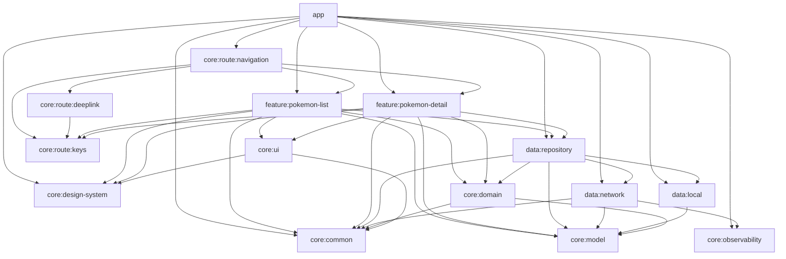

# PokedexLab

Laboratório de arquitetura Android moderno usando Jetpack Compose e tema Pokémon.

## Grafo de Dependências

```mermaid
graph TD
    app --> core_route_navigation[core:route:navigation]
    app --> core_observability[core:observability]
    app --> core_design_system[core:design-system]
    app --> core_common[core:common]
    app --> data_network[data:network]
    app --> data_local[data:local]
    app --> data_repository[data:repository]
    app --> feature_pokemon_list[feature:pokemon-list]
    app --> feature_pokemon_detail[feature:pokemon-detail]

    core_route_navigation --> core_route_keys[core:route:keys]
    core_route_navigation --> core_route_deeplink[core:route:deeplink]
    core_route_navigation --> feature_pokemon_list
    core_route_navigation --> feature_pokemon_detail

    core_route_deeplink --> core_route_keys

    feature_pokemon_list --> core_route_keys
    feature_pokemon_list --> core_common
    feature_pokemon_list --> core_design_system
    feature_pokemon_list --> core_domain[core:domain]
    feature_pokemon_list --> core_model[core:model]
    feature_pokemon_list --> core_ui[core:ui]
    feature_pokemon_list --> data_repository

    feature_pokemon_detail --> core_route_keys
    feature_pokemon_detail --> core_common
    feature_pokemon_detail --> core_design_system
    feature_pokemon_detail --> core_domain
    feature_pokemon_detail --> core_model
    feature_pokemon_detail --> core_ui
    feature_pokemon_detail --> data_repository

    data_repository --> core_domain
    data_repository --> core_model
    data_repository --> core_common
    data_repository --> data_network
    data_repository --> data_local

    data_network --> core_model
    data_network --> core_common
    data_network --> core_observability

    data_local --> core_model

    core_domain --> core_model
    core_domain --> core_common

    core_ui --> core_design_system
    core_ui --> core_common
```
