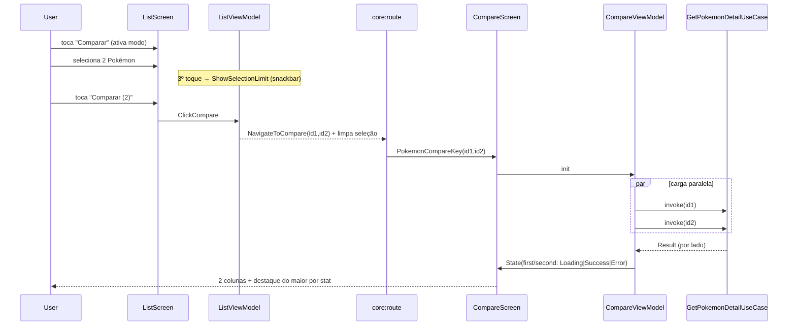

# Application Design (Consolidado) — Feature: Comparação de Pokémon

Documento consolidado. Detalhes em: `components.md`, `component-methods.md`, `services.md`, `component-dependency.md`.

## Visão geral
Nova feature MVI `feature:pokemon-compare` que compara 2 Pokémon lado a lado com todas as informações do detalhe (incl. imagem) e destaque do maior valor por stat. A seleção dos 2 Pokémon acontece na lista via um modo de seleção. Reúsa `GetPokemonDetailUseCase` e o `PokemonRepository` existentes; introduz nova `PokemonCompareKey` e deep link.

## Decisões de design (a partir das respostas)
| # | Decisão | Escolha |
|---|---|---|
| Q1 | Orquestração das 2 buscas | **ViewModel** chama `GetPokemonDetailUseCase` 2x em paralelo (sem novo use case) |
| Q2 | Falha parcial | **Por coluna** — mostra o que carregou + erro/retry inline na coluna que falhou |
| Q3 | Visual de seleção | **Borda + badge de check** no card |
| Q4 | Seleção ao navegar | **Limpa** seleção e sai do modo |
| — | UiModel | `ComparePokemonUiModel` próprio da feature (convenção do GUIDE) |
| — | DI | `pokemonCompareModule` registra só o VM; `GetPokemonDetailUseCase` resolvido do grafo Koin (sem re-registro) |

## Fluxo principal

### Estados por coluna (Q2=B)
- Cada coluna: `Loading` → `Success(ComparePokemonUiModel)` ou `Error(DomainError)` (retry individual).
- Destaque de vencedor por stat só quando **ambas** Success.

## Componentes (resumo)
- **Novo módulo** `feature:pokemon-compare`: model/state/intent/event/reducer/mapper/comparison(StatComparator)/viewmodel/screen/component/navigation/di.
- **Modificações**: `feature:pokemon-list` (modo seleção + nav), `core:route:keys` (`PokemonCompareKey`), `core:route:deeplink` (rota compare), `core:route:navigation` (entry), `:app`+`settings` (DI/include).

## Conformidade
- **GUIDE**: estrutura de feature padrão; isolamento de features (compare não conhece list/detail); navegação via `core:route:keys`; estados MVI loading/success/error/empty.
- **SECURITY-05**: validação dos ids no deep link.
- **RESILIENCY-10/06**: timeouts + fallback offline reusados; estados de erro explícitos por coluna.
- **Testes (NFR-3)**: `PokemonCompareReducer`, `StatComparator` (vencedor/empate/alinhamento por label), `PokemonCompareUiMapper`, e reducer atualizado de `pokemon-list` (seleção).

## Pendências para Code Generation
- Decoração visual exata do card selecionado e do destaque por stat (tokens do design-system).
- Layout responsivo das 2 colunas (compressão para caber em retrato — Q7=A).
- Verificar/ajustar `PokemonCard` para expor `selected`/seleção.
