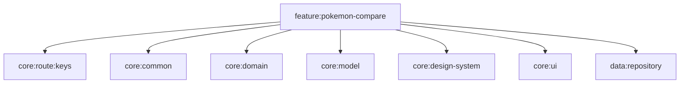
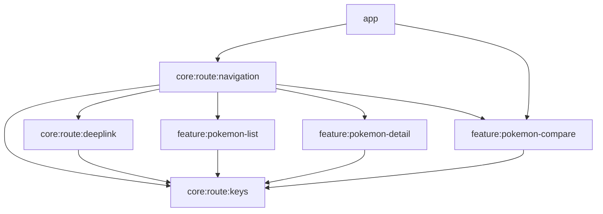

# Component Dependencies — Feature: Comparação de Pokémon

## Dependências do novo módulo `feature:pokemon-compare`
Espelha as dependências de `feature:pokemon-detail` (mesma natureza de tela de detalhe):

- **NÃO depende** de `feature:pokemon-detail` nem de `feature:pokemon-list` (regra absoluta de isolamento).
- Reúsa componentes visuais de `core:design-system` (`PokemonTypeChip`) e `core:ui` (`PokemonStatBar`).

## Grafo de navegação (montagem)

- `core:route:navigation` ganha dependência de `feature:pokemon-compare` (registra `pokemonCompareEntry`).
- `feature:pokemon-list` continua dependendo só de `core:route:keys` (usa `PokemonCompareKey` na sua nav entry — que vive em `core:route:keys`, não em outra feature).

## Padrões de comunicação
| De | Para | Mecanismo |
|---|---|---|
| ListScreen | ListViewModel | `onIntent(Intent)` |
| ListViewModel | NavEntry (lista) | `Event` (Channel) → `onNavigateToCompare(a,b)` |
| NavEntry (lista) | core:route | `navigator.navigateTo(PokemonCompareKey(a,b))` |
| CompareScreen | CompareViewModel | `onIntent(Intent)` |
| CompareViewModel | Repository | `GetPokemonDetailUseCase(id)` (x2, paralelo) |
| DeepLinkRouter | core:route | URL → `PokemonCompareKey` |

## Matriz de mudança por módulo
| Módulo | Mudança | Depende de (novo) | É dependido por (novo) |
|---|---|---|---|
| `core:route:keys` | + `PokemonCompareKey` | — | compare, list (nav entry), deeplink, navigation |
| `feature:pokemon-compare` | novo | rkeys, common, domain, model, ds, ui, repo | route:navigation, app |
| `core:route:deeplink` | + rota compare | rkeys | — |
| `core:route:navigation` | + entry | + feature:pokemon-compare | — |
| `feature:pokemon-list` | seleção + nav | (usa PokemonCompareKey de rkeys) | — |
| `:app` + `settings` | DI + include | + feature:pokemon-compare | — |

## Ordem de build (sequencial)
`core:route:keys` → `feature:pokemon-compare` → `core:route:deeplink` → `core:route:navigation` → `feature:pokemon-list` → `:app`/`settings.gradle.kts`.
