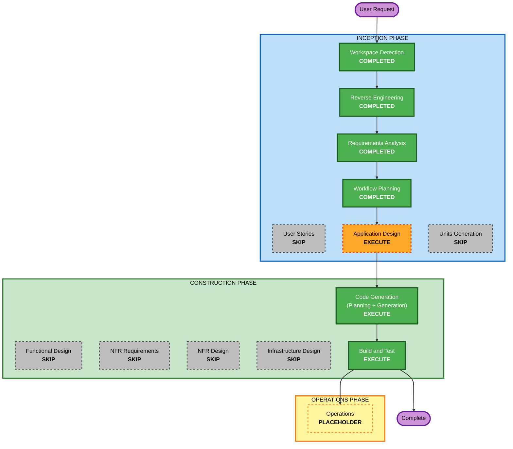

# Execution Plan — Feature: Comparação de Pokémon

## Detailed Analysis Summary

### Transformation Scope (Brownfield)
- **Transformation Type**: Single feature addition (application-layer only; no infrastructure).
- **Primary Changes**: Novo módulo `feature:pokemon-compare` (MVI) + modo de seleção em `feature:pokemon-list`.
- **Related Components**: `core:route:keys` (nova NavKey), `core:route:navigation` (nav entry), `core:route:deeplink` (deep link), `:app` (Koin module + DI), `settings.gradle.kts` (include do módulo).

### Change Impact Assessment
- **User-facing changes**: **Yes** — novo modo de seleção na lista + nova tela de comparação.
- **Structural changes**: **Yes (aditivo)** — novo módulo Gradle; sem alterar boundaries existentes além de adicionar seleção na lista.
- **Data model changes**: **No** — reúsa `Pokemon`/`getPokemonDetail`; novos modelos são apenas UI (`CompareUiModel`).
- **API changes**: **No** — nenhuma mudança na PokeAPI nem no contrato `PokemonRepository` (reúsa `getPokemonDetail`).
- **NFR impact**: **Localizado** — SECURITY-05 (validação do deep link), RESILIENCY-10/06 (timeouts/fallback/estados de erro) já cobertos por reúso.

### Component Relationships
- **Primary Component**: `feature:pokemon-compare` (novo).
- **Shared Components**: `core:domain` (use case `getPokemonDetail`), `core:model` (`Pokemon`), `core:design-system` + `core:ui` (componentes visuais), `core:route:keys`.
- **Dependent/Modified Components**: `feature:pokemon-list` (modo seleção), `core:route:navigation` (registra nav entry), `core:route:deeplink` (rota `pokedex://compare/{id1}/{id2}`), `:app` (DI).
- **Supporting Components**: `core:testing` (fakes para testes).

| Componente | Change Type | Reason | Priority |
|---|---|---|---|
| `feature:pokemon-compare` | Major (novo) | nova feature | Critical |
| `feature:pokemon-list` | Minor | modo seleção + ação Comparar | Critical |
| `core:route:keys` | Minor | nova `PokemonCompareKey` | Critical |
| `core:route:navigation` | Minor | registrar `pokemonCompareEntry` | Critical |
| `core:route:deeplink` | Minor | rota compare | Important |
| `:app` + `settings.gradle.kts` | Config | include + Koin module | Critical |

### Risk Assessment
- **Risk Level**: **Low–Medium** — mudança aditiva e isolada; sem migração de dados; reúsa repositório existente. Médio apenas pela coordenação entre poucos módulos + wiring de rota.
- **Rollback Complexity**: **Easy** — remover o módulo e reverter o modo seleção/route.
- **Testing Complexity**: **Moderate** — reducer da comparação, lógica "maior por stat", seleção na lista, mappers.

## Workflow Visualization

### Text Alternative (workflow)
- INCEPTION: Workspace Detection (COMPLETED) → Reverse Engineering (COMPLETED) → Requirements Analysis (COMPLETED) → Workflow Planning (COMPLETED) → Application Design (EXECUTE). User Stories (SKIP), Units Generation (SKIP).
- CONSTRUCTION: Code Generation (EXECUTE) → Build and Test (EXECUTE). Functional Design, NFR Requirements, NFR Design, Infrastructure Design (all SKIP).
- OPERATIONS: Placeholder.

## Phases to Execute

### INCEPTION PHASE
- [x] Workspace Detection (COMPLETED)
- [x] Reverse Engineering (COMPLETED)
- [x] Requirements Analysis (COMPLETED)
- [x] User Stories (SKIPPED)
  - **Rationale**: Feature contida, persona única (entusiasta Pokémon), cenários já capturados em requirements.md. Usuário optou por pular.
- [x] Workflow Planning (IN PROGRESS)
- [ ] Application Design - **EXECUTE**
  - **Rationale**: Novo módulo `feature:pokemon-compare` com novos componentes, nova `NavKey`, decisão sobre use case, wiring de rota e DI — boundaries precisam ser definidos. Vai incorporar também o design funcional conciso (State/Intent/Reducer/Event, `CompareUiModel`, algoritmo "maior por stat", máquina de estado de seleção na lista).
- [ ] Units Generation - **SKIP**
  - **Rationale**: Unidade única de trabalho (`pokemon-compare`); não há decomposição em múltiplas unidades independentes.

### CONSTRUCTION PHASE (unidade única: pokemon-compare)
- [ ] Functional Design - **SKIP**
  - **Rationale**: Lógica de negócio simples (máximo por stat; seleção exata de 2) e modelos apenas de UI; será coberta de forma concisa dentro da Application Design para evitar redundância. (Pode ser reativada via "Add Skipped Stages".)
- [ ] NFR Requirements - **SKIP**
  - **Rationale**: Stack já fixada (GUIDE); sem seleção de tecnologia. NFRs aplicáveis (SECURITY-05, RESILIENCY-10/06) já capturados em requirements.md.
- [ ] NFR Design - **SKIP**
  - **Rationale**: Padrões NFR aplicáveis são simples (validação de input no deep link, reúso de timeouts/fallback) e entram direto no design/código.
- [ ] Infrastructure Design - **SKIP**
  - **Rationale**: App cliente; sem infraestrutura/cloud.
- [ ] Code Generation - **EXECUTE (ALWAYS)**
  - **Rationale**: Implementação do módulo, seleção na lista, rota/deep link, DI e testes.
- [ ] Build and Test - **EXECUTE (ALWAYS)**
  - **Rationale**: `./gradlew assembleDebug` + `test`; validar reducer, mappers e lógica de comparação.

### OPERATIONS PHASE
- [ ] Operations - PLACEHOLDER

## Module Change Sequence (Brownfield)
- **Update Approach**: Sequential (dependências de compilação).
1. `core:route:keys` — adicionar `PokemonCompareKey` (base para tudo).
2. `feature:pokemon-compare` — novo módulo (depende de keys/domain/model/design-system/ui/repository).
3. `core:route:deeplink` — rota `pokedex://compare/{id1}/{id2}` (depende de keys).
4. `core:route:navigation` — registrar `pokemonCompareEntry` (depende de feature + keys + deeplink).
5. `feature:pokemon-list` — modo seleção + ação Comparar + emitir navegação para compare.
6. `settings.gradle.kts` + `:app` — include do módulo + Koin `compareModule`.
- **Coordination Points**: `PokemonCompareKey` (contrato de rota) é o ponto crítico compartilhado.
- **Testing Checkpoints**: testes unitários por módulo (reducer/mappers da compare; reducer da list) + build integrado ao final.

## Estimated Timeline
- **Total Stages restantes**: 3 (Application Design → Code Generation → Build and Test).
- **Estimated Duration**: curto — feature contida em base madura.

## Success Criteria
- **Primary Goal**: Selecionar 2 Pokémon na lista e ver comparação lado a lado com destaque do maior por stat.
- **Key Deliverables**: módulo `feature:pokemon-compare`; modo seleção na lista; rota + deep link; testes; build verde.
- **Quality Gates**: `./gradlew assembleDebug` compila; `./gradlew test` passa; reducers/mappers/lógica de comparação testados; regras do GUIDE e isolamento de features respeitados.
- **Integration**: navegação lista → comparação funcionando; deep link resolve; fallback offline preservado.
