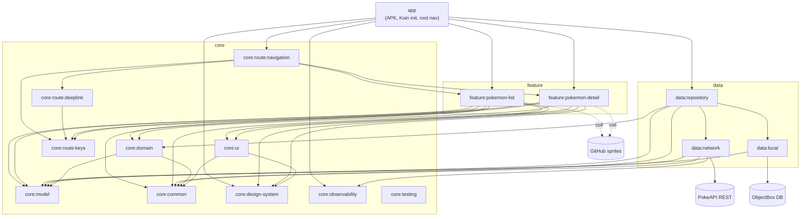
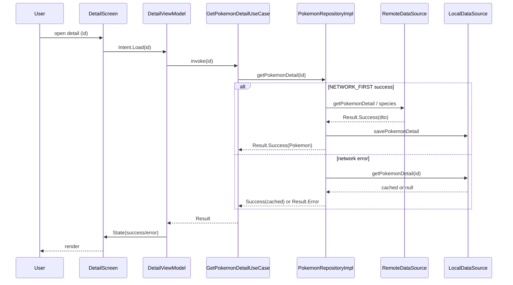

# System Architecture

## System Overview

PokedexLab is a single-APK, multi-module Android application built with Jetpack Compose. It follows **Clean Architecture** (presentation / domain / data layering) combined with an **MVI** unidirectional-data-flow pattern inside each feature. Dependency injection is provided by Koin; the `:app` module owns `startKoin` and the root navigation. The codebase is split into 17 Gradle modules grouped under `app`, `core`, `data`, and `feature`, with build configuration centralized in convention plugins under `build-logic`.

## Architecture Diagram

## Component Descriptions

### app
- **Purpose**: Application entry point and composition root.
- **Responsibilities**: `startKoin` with all modules, splash, root `AppNavDisplay`/nav graph, theme.
- **Dependencies**: features, data:*, core:route:navigation, core:observability, core:design-system.
- **Type**: Application.

### feature:pokemon-list / feature:pokemon-detail
- **Purpose**: Self-contained MVI screens.
- **Responsibilities**: ViewModel + State + Intent + Reducer + Event + screen + mapper + Koin DI.
- **Dependencies**: core:domain, core:model, core:design-system, core:ui, core:common, core:route:keys.
- **Type**: Application (UI feature). **Rule**: features never depend on each other.

### data:repository / data:network / data:local
- **Purpose**: Data layer.
- **Responsibilities**: repository orchestration + cache strategy; Retrofit API + DTO + remote paging source; ObjectBox entities + local source.
- **Type**: Application (data).

### core:* and core:route:*
- **Purpose**: Shared foundations — domain contracts/use cases, domain model, Result/DomainError/dispatchers, design system, shared UI, observability, testing fakes, and navigation.
- **Navigation split**: `core:route:keys` holds NavKeys + `AppNavigator`; `core:route:deeplink` maps Intent/URL → NavKey; `core:route:navigation` is the **assembly** module — its `AppNavDisplay` registers each feature's nav entry (`pokemonListEntry`, `pokemonDetailEntry`), so it (and only it) depends on the feature modules.
- **Type**: Shared library.

## Data Flow

## Integration Points
- **External APIs**: PokeAPI REST (`https://pokeapi.co/api/v2/`) — list, detail, species.
- **Images**: PokeAPI sprites on GitHub raw (official artwork) via Coil.
- **Databases**: ObjectBox (on-device) for cached Pokemon detail/summary.
- **Third-party Services**: None server-side; Chucker for in-app network inspection (debug).

## Infrastructure Components
- **CDK Stacks**: None (client-only mobile app; no cloud IaC).
- **Deployment Model**: Android APK/AAB installed on device.
- **Networking**: Outbound HTTPS to pokeapi.co and raw.githubusercontent.com.
