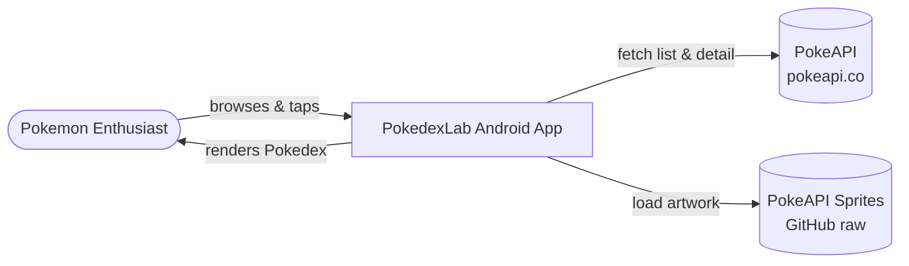

# Business Overview

## Business Context Diagram

## Business Description

- **Business Description**: PokedexLab is a modern Android reference application ("architecture laboratory") that presents a Pokedex. It lets a user browse a paginated list of Pokemon and drill into a detail screen showing a Pokemon's artwork, types, base stats, abilities and flavor description. Data is sourced from the public PokeAPI and cached locally for offline resilience. Although the data domain is Pokemon, the primary business purpose of the repository is to demonstrate a production-grade, modular Clean Architecture + MVI Android codebase.

- **Business Transactions**:
  1. **Browse Pokemon List** — User opens the app and views an infinitely scrolling, paginated grid/list of Pokemon (50 per page) loaded from PokeAPI via Paging 3.
  2. **View Pokemon Detail** — User taps a Pokemon to navigate to a detail screen showing official artwork, type chips, base-stat bars, abilities and an English flavor-text description.
  3. **Offline / Cached Read** — When the network fails (or per the configured cache strategy), previously fetched Pokemon details are served from the local ObjectBox store.
  4. **Deep Link Navigation** — External deep links resolve to specific app routes (list or a specific Pokemon detail).

- **Business Dictionary**:
  - **Pokemon**: A creature with id, name, types, stats, abilities, height, weight and description.
  - **Pokemon Summary**: Lightweight list-row projection (id + name) used in pagination.
  - **Type**: An elemental category (e.g. fire, water) with an associated brand color; up to two per Pokemon (`slot`).
  - **Stat**: A named base attribute (hp, attack, etc.) with a numeric `baseStat`.
  - **Ability**: A named capability, possibly `isHidden`.
  - **Flavor Text**: Localized descriptive blurb (English used) fetched from the species endpoint.
  - **Cache Strategy**: Runtime-selectable policy governing whether reads prefer network or local cache.

## Component Level Business Descriptions

### feature:pokemon-list
- **Purpose**: Lets users browse the full Pokedex.
- **Responsibilities**: Render paginated list, loading/error/empty states, handle row taps that emit a navigation event to detail.

### feature:pokemon-detail
- **Purpose**: Presents the full profile of a single Pokemon.
- **Responsibilities**: Load detail by id, render artwork/types/stats/abilities/description, handle loading/error/empty/retry.

### data:repository
- **Purpose**: Single source of truth orchestrating remote + local data per cache strategy.
- **Responsibilities**: Paging assembly, network-first/cache-first fetch logic, mapping DTO/entity to domain, persisting details.

### core:domain
- **Purpose**: Encodes the business use cases independent of frameworks.
- **Responsibilities**: `GetPokemonListUseCase`, `GetPokemonDetailUseCase`, repository contract.
