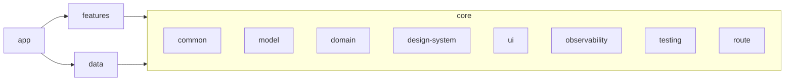

    # Code Structure

## Build System
- **Type**: Gradle (Kotlin DSL), Gradle 9.3.1, AGP 9.1.1, Kotlin 2.2.10.
- **Configuration**: Convention plugins in `build-logic/convention/` centralize Android/Kotlin/Compose/feature config. Version catalog in `gradle/libs.versions.toml`. 17 modules wired in `settings.gradle.kts`.
- **Critical rule**: Never apply `org.jetbrains.kotlin.android` explicitly — AGP 9.x registers the `kotlin` extension internally (else `IllegalArgumentException: Cannot add extension with name 'kotlin'`).

## Module Hierarchy

### Existing Files Inventory (modification candidates)

**app**
- `app/.../MainActivity.kt` - Compose host activity.
- `app/.../PokedexLabApplication.kt` - Application, `startKoin`.
- `app/.../navigation/AppNavGraph.kt` - Root navigation wiring.
- `app/.../ui/theme/{Color,Theme,Type}.kt` - App-level theme (legacy; design-system has its own).

**core:common**
- `di/CommonModule.kt`, `dispatcher/DispatcherProvider.kt`, `error/ErrorHandler.kt`, `result/DomainError.kt`, `result/Result.kt`.

**core:domain**
- `repository/PokemonRepository.kt` - repo contract (`getPokemonList`, `getPokemonDetail`).
- `usecase/GetPokemonListUseCase.kt`, `usecase/GetPokemonDetailUseCase.kt`.

**core:model**
- `Pokemon.kt` - `Pokemon`, `PokemonType`, `PokemonStat`, `PokemonAbility`, `PokemonSummary`.

**core:design-system**
- `theme/{Color,Shape,Spacing,Theme,Type}.kt`; `component/{EmptyContent,ErrorContent,LoadingIndicator,PokemonTypeChip,ShimmerBox}.kt`; `util/PokemonImageUrlProvider.kt`.

**core:ui** - `PokemonStatBar.kt`.
**core:observability** - `AppLogger.kt` (Timber).
**core:testing** - `dispatcher/TestDispatcherProvider.kt`, `fake/FakePokemonData.kt`, `fake/FakePokemonRepository.kt`, `rule/MainDispatcherRule.kt`.

**core:route**
- `keys/RouteKeys.kt` (`PokemonListKey`, `PokemonDetailKey`), `keys/AppNavigator.kt`.
- `navigation/AppNavDisplay.kt`, `navigation/NavBackStackNavigator.kt`.
- `deeplink/DeepLinkRouter.kt`.

**data:network**
- `api/PokemonApiService.kt`, `dto/{PokemonDetailDto,PokemonListResponseDto,PokemonSpeciesDto}.kt`, `paging/PokemonRemotePagingSource.kt`, `source/RemotePokemonDataSource.kt`, `di/NetworkModule.kt`.

**data:local**
- `entity/{PokemonDetailEntity,PokemonSummaryEntity}.kt`, `mapper/PokemonEntityMapper.kt`, `source/LocalPokemonDataSource.kt`, `di/LocalModule.kt`.

**data:repository**
- `PokemonRepositoryImpl.kt`, `CacheStrategy.kt`, `mapper/{PokemonDtoMapper,PokemonEntityMapper}.kt`, `di/RepositoryModule.kt`.

**feature:pokemon-list / pokemon-detail**
- `viewmodel/`, `ui/{state,intent,reducer,event,model,screen,component}/`, `mapper/`, `navigation/*NavEntry.kt`, `di/*Module.kt`.

## Design Patterns

### Clean Architecture
- **Location**: core (domain/model) ⟷ data ⟷ feature.
- **Purpose**: Framework-independent business rules; dependency rule points inward.

### MVI (Model-View-Intent)
- **Location**: each feature module.
- **Implementation**: `Screen → Intent → ViewModel → Reducer (pure) → State`, ephemeral `Event` for nav/snackbar.

### Repository + Strategy
- **Location**: `data:repository`.
- **Implementation**: `PokemonRepositoryImpl` switches fetch path on `CacheStrategy` enum.

### Paging (Paging 3)
- **Location**: `PokemonRemotePagingSource`, repository `Pager`.

### Convention Plugins
- **Location**: `build-logic/convention`.
- **Purpose**: DRY Gradle config across modules.

## Critical Dependencies
- **Koin 4.2.1** — DI across all modules.
- **Retrofit 3.0.0** — REST client (`PokemonApiService`).
- **ObjectBox 5.4.2** — local persistence (entities + KSP).
- **Paging 3 (3.3.6)** — list pagination.
- **Navigation3 1.1.1** — type-safe nav keys + NavDisplay.
- **Coil 3.4.0** — async image loading.
