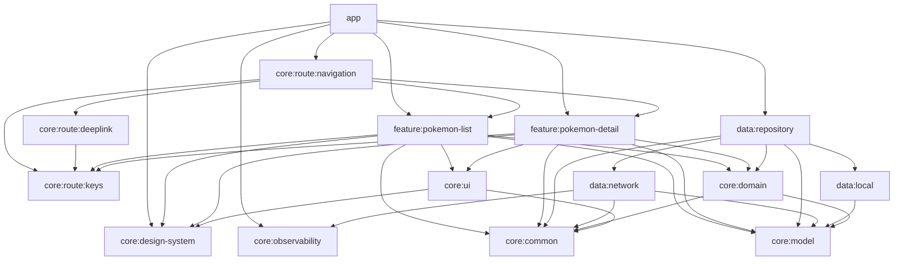

# Dependencies

## Internal Dependencies

### Key internal dependency rules
- **app → feature:*, data:*, core:route:navigation, core:observability, core:design-system, core:common** (Runtime/Compile) — composition root.
- **core:route:navigation → core:route:keys, core:route:deeplink, feature:*** — navigation **assembly** module; it is the only place that knows every feature's nav entry, composing them into the `NavDisplay`.
- **feature:* → core:domain, core:model, core:design-system, core:ui, core:common, core:route:keys** (Compile) — features depend only on shared core + `core:route:keys` (NavKeys), never on `core:route:navigation`.
- **features never depend on each other** (absolute rule) — features expose nav entries + use only NavKeys; wiring happens in `core:route:navigation`.
- **data:repository → data:network + data:local + core:domain + core:model + core:common** — data orchestration.
- **core:domain → core:model + core:common only** — pure business layer.

## External Dependencies

### Retrofit (3.0.0)
- **Purpose**: HTTP client for PokeAPI. **License**: Apache-2.0.

### Koin (4.2.1)
- **Purpose**: Dependency injection. **License**: Apache-2.0.

### ObjectBox (5.4.2)
- **Purpose**: On-device persistence. **License**: Apache-2.0 (core).

### Paging 3 (3.3.6)
- **Purpose**: Pagination. **License**: Apache-2.0.

### Navigation3 (1.1.1)
- **Purpose**: Type-safe navigation. **License**: Apache-2.0.

### Coil (3.4.0)
- **Purpose**: Image loading. **License**: Apache-2.0.

### Jetpack Compose / Material3 (BOM 2026.02.01)
- **Purpose**: Declarative UI. **License**: Apache-2.0.

### Timber (5.0.1) / Chucker (4.0.0)
- **Purpose**: Logging / debug network inspection. **License**: Apache-2.0.

### JUnit 5 (5.11.0) / MockK (1.13.12)
- **Purpose**: Testing. **License**: EPL-2.0 / Apache-2.0.
